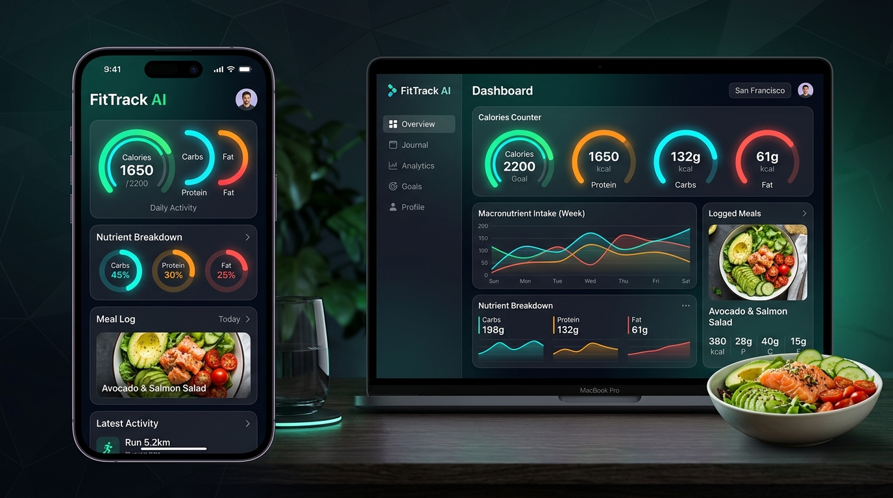

# 🏋️‍♂️ FitTrack AI - Professional Fitness & Nutrition Platform



FitTrack AI is an all-in-one, intelligent health, fitness, and nutrition web application built using **Django** and **Vanilla CSS**. It empowers users to monitor their biometrics, log meals and workouts, track macro targets, receive real-time AI nutrition recommendations, and dispatch emergency distress SOS alerts.

---

## ✨ Key Features

- 🎯 **Daily Target System (Auto-Reset)**: Real-time tracking of daily calorie intake, active calorie burn, and protein goals. Counters automatically start at **0** every morning at 12:01 AM.
- 🚨 **SOS Emergency Distress System**: Integrated one-touch 3-second countdown emergency alert system. Sends geolocation coordinates and biometric backups to registered emergency contacts.
- 🥗 **Multi-Ingredient AI Macro Decomposition**: Built-in USDA Food Dataset engine (500+ items) analyzing total calories, protein, carbohydrates, and fats.
- 🤖 **AI ChatGPT-Style Health Advisor**: Context-aware AI assistant answering nutrition, workout, supplement, and wellness queries while referencing live user context.
- 📊 **7-Day Trend Visualizations**: Interactive Chart.js graphs displaying caloric intake, active burn, and macro balances over time.
- 📄 **Multi-Format Export Reports**: Instant generation of official health reports downloadable in **PDF**, **CSV**, **Excel**, **JSON**, and **HTML** formats.
- 👤 **Custom Biometrics & Goals**: Mifflin-St Jeor BMR and TDEE auto-calculations for Weight Loss, Maintenance, and Muscle Gain goals.

---

## 🛠️ Technology Stack

- **Backend**: Python 3.12+, Django 5.2
- **Frontend**: HTML5, Vanilla CSS3 (Custom design system, HSL color tokens), JavaScript (ES6+)
- **Database**: SQLite3
- **Visualization**: Chart.js
- **Icons & Typography**: FontAwesome 6, Google Inter & JetBrains Mono Fonts
- **Email Dispatch**: Django Mail (SMTP / Custom From-Name Masking)

---

## 🚀 Quick Start & Installation

### 1. Clone the Repository
```bash
git clone https://github.com/ChandrakanthBS/FitTrackAI.git
cd FitTrackAI
```

### 2. Set Up Virtual Environment
```bash
# Windows
python -m venv venv
venv\Scripts\activate

# macOS / Linux
python3 -m venv venv
source venv/bin/activate
```

### 3. Install Dependencies
```bash
pip install django pillow
```

### 4. Configure Environment Variables
Create or verify the `.env` file in the root folder:
```env
EMAIL_HOST_USER=your_email@gmail.com
EMAIL_HOST_PASSWORD=your_gmail_app_password
DEFAULT_FROM_EMAIL=FitTrack AI <your_email@gmail.com>
```

### 5. Run Database Migrations
```bash
python manage.py migrate
```

### 6. Start the Development Server
```bash
python manage.py runserver
```

Open your browser and visit `http://127.0.0.1:8000/`.

---

## 📁 Directory Structure

```
FitTrackAI/
├── core/                   # Main Django app (views, models, templates, static)
│   ├── static/core/        # Custom CSS, JS scripts, images
│   ├── templates/core/     # HTML templates (Dashboard, Profile, Reports, etc.)
│   ├── food_dataset.py     # USDA food dataset dictionary
│   ├── models.py           # UserProfile, FoodLog, ExerciseLog models
│   ├── views.py            # Business logic, AI engine, emergency SOS, reports
│   └── tests.py            # Unit test suite
├── fittrack_ai/            # Django project settings & URLs
│   ├── settings.py
│   └── urls.py
├── .env                    # Local environment variables
├── .gitignore              # Git ignore configuration
├── db.sqlite3              # Local database
├── manage.py               # Django management script
└── README.md               # Project documentation
```

---

## 🧪 Running Unit Tests

Run the test suite to verify all system components and target reset functionality:
```bash
python manage.py test
```

---

## 🔒 Security & Privacy

- Sender email display name is masked as **`FitTrack AI`** to ensure official presentation.
- All sensitive keys are configured through environment variables.
